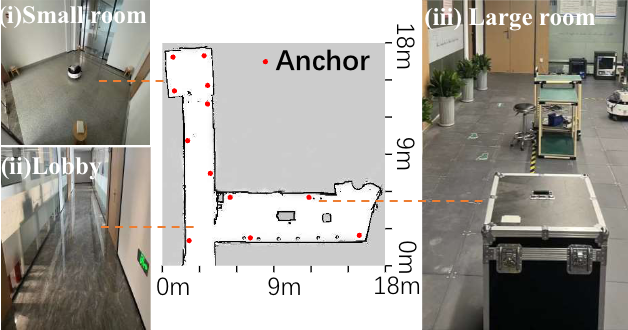

# MetaSonic: Advancing Robot Localization with Directional Embedded Acoustic Signals

Indoor positioning in environments where GPS cannot be used is a fundamental technology for robotics navigation and human-robot interaction. However, existing vision-based localization systems cannot work in dark environments, and existing wireless or acoustic localization systems require specific transceivers, making them expensive and power-intensive — particularly challenging for micro-robots.
This paper proposes a new metasurface-assisted ultrasound positioning system. The key idea is to use a low-cost passive acoustic metasurface to transfer any speaker into a directional ultrasound source, with the acoustic spectrum varying based on direction. This allows any microrobot with a simple, low-cost microphone to capture such modified sound to identify the direction of the sound source. We develop a lightweight convolutional neural network-based localization algorithm that can be efficiently deployed on low-power microcontrollers. 

## Anchor Depoyment
Our localization scenarios are evaluated in the following three rooms: a 3.5 m × 4 m small room, a 2 m × 14 m lobby, and a 5 m × 12 m large room. Four anchors are deployed in each scene. The deployment of anchors is as follows. The anchors's depolyment is as follows.

## Demo Vedio
The video demonstrates a scenario where four anchors are deployed in the environment. As the robot moves, the spectrograms of the four anchors, as perceived by the robot, dynamically change with variations in position.
<video width="640" height="360" controls>
  <source src="./img/spectrum_and_moving_robot_.mp4" type="video/mp4">
  Your browser does not support the video tag.
</video>
