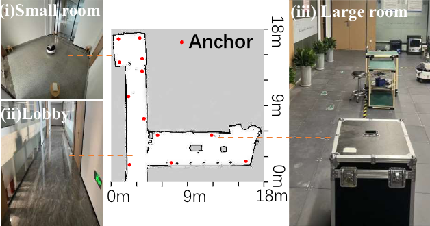

# MetaSonic: Advancing Robot Localization with Directional Embedded Acoustic Signals

Indoor positioning in environments where GPS cannot be used is a fundamental technology for robotics navigation and human-robot interaction. However, existing vision-based localization systems cannot work in dark environments, and existing wireless or acoustic localization systems require specific transceivers, making them expensive and power-intensive — particularly challenging for micro-robots.
This paper proposes a new metasurface-assisted ultrasound positioning system. The key idea is to use a low-cost passive acoustic metasurface to transfer any speaker into a directional ultrasound source, with the acoustic spectrum varying based on direction. This allows any microrobot with a simple, low-cost microphone to capture such modified sound to identify the direction of the sound source. We develop a lightweight convolutional neural network-based localization algorithm that can be efficiently deployed on low-power microcontrollers. 

[Read the paper on here](https://github.com/Anplus/metasonic/blob/page/metasonic.pdf)  

## Anchor Deployment
Our localization scenarios are evaluated in the following three rooms: a 3.5 m × 4 m small room, a 2 m × 14 m lobby, and a 5 m × 12 m large room. Four anchors are deployed in each scene. The deployment of anchors is as follows.

  

## Demo Video
The video demonstrates a scenario where four anchors are deployed in the environment. As the robot moves, the spectrograms of the four anchors, as perceived by the robot, dynamically change with variations in position.

  <video width="640" height="360" controls>
    <source src="./img/position_spectrum_moving_robot.mp4" type="video/mp4">
    Your browser does not support the video tag.
  </video>

## References

To cite our paper, use the following BibTeX entry:

@article{wang2025metasonic,
  title={MetaSonic: Advancing Robot Localization with Directional Embedded Acoustic Signals},
  author={Wang, Junling and An, Zhenlin and Guo, Yi},
  journal={IEEE Robotics and Automation Letters},
  year={2025},
  publisher={IEEE}
}
